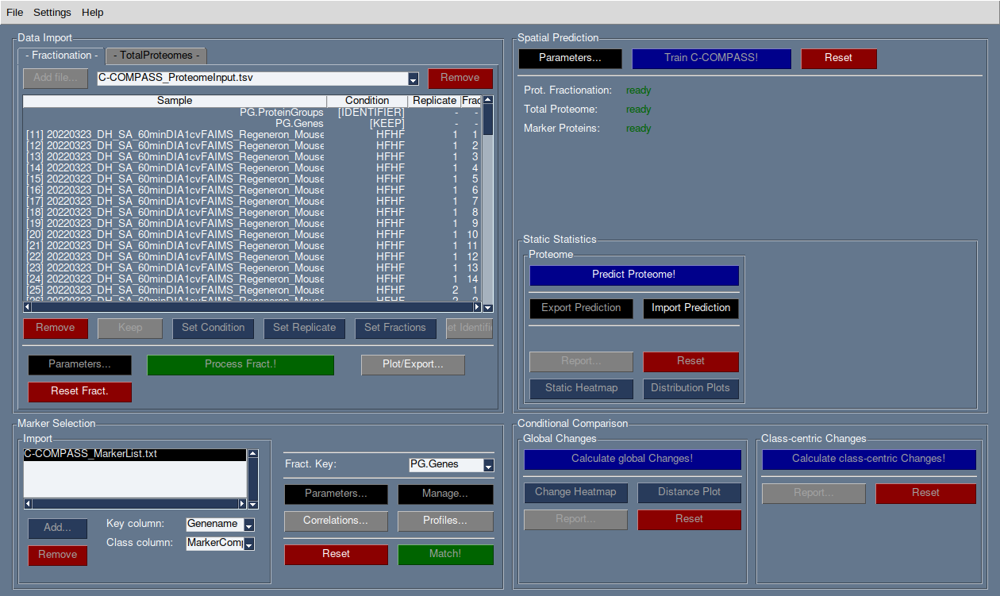

# C-COMPASS

[](https://badge.fury.io/py/ccompass)
[](https://c-compass.readthedocs.io)
[](https://doi.org/10.5281/zenodo.14712134)


**C-COMPASS** (Cellular COMPartmentclASSifier) is an open-source software tool designed to predict the spatial distribution of proteins across cellular compartments. It uses a neural network-based regression model to analyze multilocalization patterns and integrate protein abundance data while considering different biological conditions. C-COMPASS is designed to be accessible to users without extensive computational expertise, featuring an intuitive graphical user interface.

The data analyzed by C-COMPASS typically derives from proteomics fractionation samples that result in compartment-specific protein profiles. Our tool can be used to analyze datasets derived from various experimental techniques.



## Key Features

- **Protein Localization Prediction**: Use a neural network to predict the spatial distribution of proteins within cellular compartments.
- **Dynamic Compartment Composition Analysis**: Model changes in compartment composition based on protein abundance data under various conditions.
- **Comparison of Biological Conditions**: Compare different biological conditions to identify and quantify relocalization of proteins and re-organization of cellular compartments.
- **Multi-Omics Support**: Combine your proteomics experiment with different omics measurements such as lipidomics to bring your project to the spacial multi-omics level.
- **User-Friendly Interface**: No coding skills required; the tool features a simple GUI for conducting analysis.

## Documentation

Further documentation is available at https://c-compass.readthedocs.io/en/latest/.

## Installation

### Single-file executables

Single-file executables that don't require a Python installation are available
on the [release page](https://github.com/ICB-DCM/C-COMPASS/releases)
for Linux, Windows, and macOS.
Download the appropriate file for your operating system and run it.

On Windows, make sure to install the Microsoft C and C++ (MSVC) runtime
libraries before ([further information](https://learn.microsoft.com/en-us/cpp/windows/latest-supported-vc-redist?view=msvc-170),
[direct download](https://aka.ms/vs/17/release/vc_redist.x64.exe)).

Unreleased versions can be downloaded from
[](https://github.com/ICB-DCM/C-COMPASS/actions/workflows/bundle.yml).
(Click on the latest run, then choose the version for your operating system
from the "Artifacts" section. Requires a GitHub account.)

### Via pip

```bash
# install
pip install ccompass

# launch the GUI
ccompass
# or alternatively: `python -m ccompass`
```

C-COMPASS currently requires Python>=3.11.

On Ubuntu linux, installing the `python3-tk` package is required:

```bash
sudo apt-get install python3-tk
```

To install the latest development version from GitHub, use:

```bash
pip install 'git+https://github.com/ICB-DCM/C-COMPASS.git@main#egg=ccompass'
```

### Troubleshooting

If you encounter any issues during installation, please refer to the
[troubleshooting guide](https://c-compass.readthedocs.io/en/latest/installation.html#troubleshooting).

## Usage

See also https://c-compass.readthedocs.io/en/latest/usage.html.

* The GUI will guide you through the process of loading and analyzing your
  proteomics dataset, including fractionation samples and Total Proteome
  samples.
* Follow the on-screen instructions to perform the analysis and configure
  settings only if required
* Standard parameters should fit for the majority of experiments.
  You don't need to change the default settings.

## Contributing

Contributions to C-COMPASS are welcome!

For further information, please refer to
[https://c-compass.readthedocs.io/en/latest/contributing.html](https://c-compass.readthedocs.io/en/latest/contributing.html).

## Example Data

A simulated dataset and pre-defined sessions for testing purpose are available at
[https://zenodo.org/records/15223914](https://zenodo.org/records/15223914).

## License

C-COMPASS is licensed under the [BSD 3-Clause License](LICENSE).

## Citation

If you use C-COMPASS in your research, please cite the following
[publication](https://doi.org/10.1038/s41592-025-02880-3):

```bibtex
@Article{HaasWei2025,
  author           = {Haas, Daniel T. and Weindl, Daniel and Kakimoto, Pamela and Trautmann, Eva-Maria and Schessner, Julia P. and Mao, Xia and Gerl, Mathias J. and Gerwien, Maximilian and Müller, Timo D. and Klose, Christian and Cheng, Xiping and Hasenauer, Jan and Krahmer, Natalie},
  journal          = {Nature Methods},
  title            = {{C-COMPASS}: a user-friendly neural network tool profiles cell compartments at protein and lipid levels},
  year             = {2025},
  issn             = {1548-7105},
  month            = dec,
  doi              = {10.1038/s41592-025-02880-3},
  publisher        = {Springer Science and Business Media LLC},
}
```

## Contact

For any questions, contact `daniel.haas@helmholtz-munich.de` or post an
issue at https://github.com/ICB-DCM/C-COMPASS/issues/.
